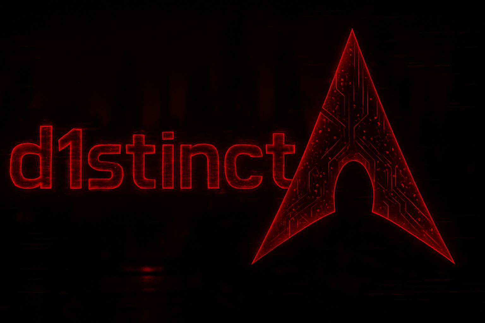

<div align="center">
  
  <br/>
  <h1>arch-dotfiles · Valerie Rice</h1>
  <p>
    <b>bspwm</b> rice for daily driving and HTB helpers<br/>
    by <a href="https://github.com/Vleizx">Vleiz</a>
  </p>
  <p>
    
    
    
    
  </p>
</div>

---

## Preview

| Component | Screenshot |
|-----------|------------|
| Desktop & Polybar |  |
| Rofi Launcher |  |

---

## Quick Install

```bash
git clone https://github.com/Vleizx/arch-dotfiles.git
cd arch-dotfiles
./install.sh
```

> **Do NOT run as root.** The script asks for sudo only for official Arch packages.

### What the installer does

1. **Packages:** installs only Valerie dependencies from official Arch repositories
2. **Backup:** backs up your current config to `~/.RiceBackup/<date>`
3. **Dotfiles:** copies bspwm, Polybar, Rofi, Eww, GTK, Thunar and `~/`
4. **Assets:** installs bundled Valerie themes, icons, cursor and fonts
5. **Services:** enables MPD and the official-package update timer
6. **Hardware:** detects monitors, network, battery and backlight automatically
7. **Dark mode:** sets GTK and desktop preferences to Valerie dark mode
8. ✅ **Done:** log out and start bspwm

The bundled Eww and i3lock-color-compatible binaries target `x86_64` Arch systems.
No AUR helper, custom repository, external installer or `git clone` is used by
`install.sh`.

---

## Packages

### HTB and Network Scripts (`~/.config/bin/`)

Small helpers retained for HTB and network work:

| Script | Function |
|--------|----------|
| `htb` `vpn` `lan` `wan` | Connection shortcuts |
| `vpn.sh` `lan.sh` `wan.sh` | Connect to VPN/LAN/WAN |
| `target` | Set current target |
| `mytarget.sh` | Show current target |
| `copyTarget.sh` | Copy target IP to clipboard |
| `copyLAN.sh` | Copy LAN IP |
| `copyVPN.sh` | Copy VPN IP |
| `copyWAN.sh` | Copy WAN IP |

### Valerie BSPWM Scripts (`~/.config/bspwm/bin/`)

| Script | Function |
|--------|----------|
| `Theme.sh` | Switch theme / colors |
| `RiceSelector` | Visual rice selector |
| `RiceEditor` | Edit current rice |
| `WallSelect` | Wallpaper picker |
| `AnimatedWall` | Animated wallpaper (.mp4) |
| `WallSync` | Sync wallpapers |
| `PowerMenu` | Shutdown menu (rofi) |
| `RofiLauncher` | App launcher (rofi) |
| `RofiPass` | Password selector |
| `ScreenShoTer` | Screenshots |
| `ScreenLocker` | Screen lock |
| `NetManagerDM` | Network manager (rofi) |
| `Volume` | Volume control |
| `Brightness` | Brightness control |
| `MediaControl` | Media control |
| `KeyBoardL` | Keyboard layout |
| `MonitorSetup` | Monitor configuration |
| `Bspwm-ScratchPad` | Scratchpad |
| `HideBar` / `HideNode` | Toggle bar/nodes |
| `SoftReload` | Reload bspwm without logout |
| `OpenApps` | Open default apps |
| `Updates` | Check updates |
| `Weather` | Weather in polybar |
| `ExternalRules` | External bspwm rules |
| `SetSysVars` | System variables |
| `batterylevel.sh` | Battery level |
| `Term` | Default terminal |

### Valerie Dependencies

| Category | Packages |
|----------|----------|
| **Terminal** | alacritty |
| **Shell** | zsh + zsh-autosuggestions, zsh-syntax-highlighting, zsh-history-substring-search |
| **Bar / Launcher** | polybar, rofi, jgmenu, eww |
| **Compositor** | picom (animations) |
| **Notifications** | dunst |
| **GTK / Icons / Cursor** | Flat-Remix-GTK-Red-Darkest, Dracula, Qogirr-Dark (bundled) |
| **Fonts** | JetBrainsMono Nerd Font, Terminus Nerd Font, Inconsolata, Phosphor, Material Design Icons |
| **Multimedia** | mpd, mpc, ncmpcpp, ffmpeg, playerctl, pamixer, pavucontrol |
| **Productivity** | neovim, geany, yazi |
| **Browser / Files** | firefox, thunar, tumbler, gvfs |
| **Utilities** | bat, eza, fzf, jq, flameshot, xclip |
| **Audio** | pipewire, pipewire-pulse, pipewire-alsa, wireplumber |
| **HTB / Network** | curl, iproute2, openvpn, libnotify |

---

## Dotfiles Structure

```
~/.config/
├── bspwm/           # Window manager & scripts
│   ├── bspwmrc      # Main config
│   ├── bin/         # Valerie bspwm tools
│   ├── config/      # Modules, rofi themes, picom, sxhkd, fonts
│   ├── eww/         # Eww widgets (cheatsheet, player, profile)
│   └── rices/       # Theme valerie
├── alacritty/       # Terminal
├── polybar/         # Polybar config + scripts
├── rofi/            # Rofi (launcher, powermenu, etc.)
├── gtk-3.0/         # GTK3 settings
├── gtk-4.0/         # GTK4 settings
├── clipcat/         # Clipboard manager
├── mpd/             # Music Player Daemon
├── ncmpcpp/         # Music player client
├── yazi/            # File manager
├── dunst/           # Notifications
├── picom/           # Compositor (animations)
├── btop/            # System monitor
├── networkmanager-dmenu/  # NetworkManager frontend
└── systemd/user/    # User services

~/ 
├── .zshrc           # Zsh config and HTB/network helpers
├── .fehbg           # Wallpaper setter
└── .xsettingsd      # GTK settings daemon
```

---

## Valerie Theme

Single dark red/neon theme. Includes:

- **Terminal:** Alacritty with custom color scheme
- **Polybar:** Pentesting modules (VPN, target, LAN, WAN), system, multimedia
- **GTK:** Flat-Remix-Red-Darkest + Dracula icons + Qogirr cursor
- **Dunst:** Notifications with bundled BeautyLine icons
- **Picom:** Custom animations

### Keybindings

| Key | Action |
|-----|--------|
| `Super + Enter` | Terminal |
| `Super + Space` | Rofi launcher |
| `Super + d` | Rofi app menu |
| `Super + w` | Close window |
| `Super + Shift + q` | Quit bspwm |
| `Super + Ctrl + r` | Reload bspwm |
| `Super + Escape` | Kill notifications / Powermenu |
| `Super + Shift + p` | Wallpaper picker |
| `Super + Shift + r` | Rice selector |
| `Super + {1-9}` | Go to workspace N |
| `Super + Shift + {1-9}` | Move window to workspace N |
| `Super + h/j/k/l` | Navigate windows |
| `Super + Shift + h/j/k/l` | Move window |
| `Super + Tab` | Next window |
| `Super + Shift + Tab` | Toggle floating |
| `Super + f` | Fullscreen |
| `Super + t` | Tiled layout |
| `Super + Shift + t` | Monocle layout |
| `Super + Shift + m` | Fake layout |
| `Super + {b, comma, period}` | Focus node |
| `Super + {x, z}` | Grow window |
| `Super + {c, v}` | Rotate |

### Monitor Layout

`MonitorSetup` detects connected X11 monitors with `xrandr`.

- One monitor: workspaces `1 2 3 4 5 6 7 8 9 0`
- Two monitors: primary/left gets `1 2 3 4 5`
- Two monitors: secondary/right gets `6 7 8 9 0`

---

## Manual

```bash
# Manual backup
cp -r ~/.config/bspwm ~/.config/bspwm.bak

# Change wallpaper
~/.config/bspwm/bin/WallSelect

# Change color scheme
~/.config/bspwm/bin/Theme.sh
```

---

## Notes

- First boot may be slow while caches generate.
- Valerie's default wallpapers are bundled; the wallpaper engine also supports local animated files.
- All Valerie fonts are copied to `~/.local/share/fonts/`.
- Existing files are moved to `~/.RiceBackup/<date>` before replacement.

---

<p align="center">
  <b>Made with ❤️ by Vleiz</b><br/>
  <i>Based on <a href="https://github.com/gh0stzk/dotfiles">gh0stzk/dotfiles</a></i>
</p>
